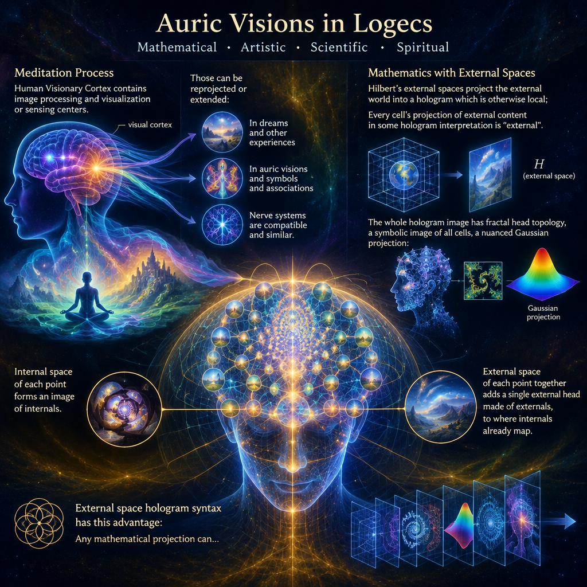

<br>

# Auric Visions in Logecs

Meditation process:
- Human Visionary Cortex contain image processing and visualization or sensing centers.
- Those can be reprojected or extended:
  - In dreams and other experiences, the same system is connected to different "external" system, able to play it's role.
  - In auric visions and symbols and associations, visual cortex is not redirected completely, but added channels are added.
- Nerve systems are compatible and similar.

Mathematics with external spaces:
- Hilbert's external spaces project external world into hologram which is otherwise local;
  - Every cell's projection of external content in some hologram interpretation is "external".
- The whole hologram image has fractal head topology, a symbolic image of all cells, a nuances gaussian projection:
  - Internal space of each point forms image of internals.
  - External space of each point together, adds single external head made of externals, to where internals already map.
 
External space hologram syntax has this advantage:
- Any mathematical projection can be used, physics-consistent projections each deserve equal name of space.
- Mathematics can use same syntax for internal-external space of mental math, and physics interpretation.
- The layer which consistently projects, when interpreted nicely:
  - Human meditation turns visualization of models, symbols and metarealms to visual associations.
  - When meditating, these become more vivid and similar to normal vision.
- When same filters are added between mental local-global, and physical local-global projection, the resulting view of external, mapped properly, is Laegna equivalent to auric vision.

---

CoPilot:

# Auric Visions in Logecs

## Introduction

Within Laegna Logecs, auric vision is not treated as a supernatural exception nor as a proof of external metaphysical entities. Instead, it is modeled as a consistent relationship between perception, visualization, symbolic cognition, projection spaces, and interpretation layers.

The purpose of this framework is not to declare what auric visions "are", but to provide a mathematical and logical syntax capable of describing experiences that humans report during meditation, dreams, symbolic perception, intuition, and enhanced visualization states.

In this context, an auric vision becomes a type of projection phenomenon occurring between internal and external spaces.

---

# 1. Visionary Cortex Extension Hypothesis

## Basic idea

Human brains already contain:

- Visual processing systems.
- Spatial reconstruction systems.
- Symbol recognition systems.
- Mental imagery systems.

When a person imagines an apple, dreams of a landscape, or recalls a face, they are using the same visual machinery that participates in ordinary vision.

Therefore:

```text
Vision ≠ only retinal input

Vision =
    Retinal Input
    + Internal Reconstruction
    + Symbolic Projection
    + Associative Completion
```

The visual cortex is already capable of generating visual experiences without direct sensory input.

Dreams demonstrate this fact daily.

---

## Dreams as External Reprojection

In dreams, normal sensory input is largely disconnected.

Yet visual experience continues.

From a Logecs perspective:

```text
Normal Vision:
External Input
    →
Visual Cortex

Dream Vision:
Alternative Input
    →
Visual Cortex
```

The cortex itself remains the projection surface.

Only the source of information changes.

This makes dreams evidence that perception systems can operate with multiple input channels.

---

## Auric Vision as Partial Extension

Auric vision differs from dreaming.

The visual system is not fully redirected.

Instead:

```text
Physical Vision
      +
Additional Association Layers
      +
Symbolic Projection Layers
```

remain active simultaneously.

One may perceive:

- colors,
- symbolic forms,
- emotional geometry,
- intuitive associations,

while still seeing the ordinary physical world.

In this model, auric vision is not a replacement vision.

It is an augmented vision.

---

# 2. Nerve System Compatibility

A central assumption is that information-processing systems share compatible structures.

For example:

- neurons exchange signals,
- cortical maps process patterns,
- networks perform transformations.

Therefore, different information domains may become mappable through common structures.

Symbolically:

```text
Structure A
   ↔
Structure B
```

if transformation rules exist.

This allows a visual representation of non-visual information.

Examples:

- emotions visualized as colors,
- relationships visualized as shapes,
- concepts visualized as symbols.

Modern cognition already performs such mappings automatically.

---

# 3. Hilbert External Spaces

## Motivation

Traditional mathematics often describes objects as existing inside abstract spaces.

Hilbert spaces provide one important example.

Laegna extends this notion by introducing external-space interpretations.

Instead of saying:

```text
Observer
    sees
World
```

we can express:

```text
Observer
    projects
World
into
Representation Space
```

The experienced world becomes a constructed image.

---

## External Projection

Every cell only accesses local information.

Yet the organism experiences a coherent world.

This implies a reconstruction process.

One interpretation is:

```text
External Reality
      →
Distributed Cellular Processing
      →
Unified Internal Hologram
```

The hologram is local.

Its represented content is external.

This creates a distinction:

```text
Local representation

vs

Represented external domain
```

---

# 4. Fractal Head Topology

The complete perceptual image can be modeled as a recursive structure.

Each point possesses:

- internal relations,
- external relations.

Thus every point may contain a miniature representation of whole-system information.

Symbolically:

```text
Whole
contains
Parts

Parts
contain
compressed Whole
```

This resembles:

- holographic principles,
- fractal descriptions,
- recursive knowledge graphs.

The "head" becomes the global projection surface produced by all local processing units.

---

## Internal Space

Each point possesses its own internal organization.

```text
Point
 →
Internal Space
```

This corresponds to:

- local memory,
- local state,
- local processing.

---

## External Space

Each point also refers beyond itself.

```text
Point
 →
External Space
```

These outward references collectively generate a shared image of externality.

The resulting structure is:

```text
Internal Spaces
      +
External Spaces
      =
Unified Holographic Reality
```

---

# 5. Unified Mathematical Syntax

One strength of the model is syntactic unification.

The same notation can describe:

### Physics

```text
Particle
 →
Field
 →
Projection
```

### Cognition

```text
Neuron
 →
Mental Model
 →
Visualization
```

### Symbolic Experience

```text
Meaning
 →
Association
 →
Vision
```

The mathematical language remains unchanged.

Only interpretation changes.

This provides conceptual economy.

---

# 6. Meditation as Projection Amplification

During meditation, several effects commonly occur:

- reduced sensory competition,
- increased attention,
- stronger imagery,
- enhanced symbolic association.

Within this framework:

```text
Visualization Gain ↑

Association Gain ↑

Noise ↓
```

As a result:

Mental representations become increasingly vivid.

The experience may begin resembling ordinary vision.

The transition is gradual rather than absolute.

---

## Symbolic Realms

Meditative states frequently produce:

- archetypal imagery,
- geometric forms,
- symbolic narratives,
- personified concepts.

The framework interprets these as projections from higher-order association networks.

Not necessarily as independent ontological worlds.

The model remains neutral regarding metaphysical interpretation.

---

# 7. Auric Vision as Local-Global Mapping

The key Laegna insight is that similar mathematical filters may operate at multiple scales.

For example:

```text
Local Mind
      ↔
Global Mental Model

Local Observer
      ↔
Global Physical Model
```

If identical projection structures are applied to both domains:

```text
Mental Projection
      ~
Physical Projection
```

then visualization, symbolism, and environmental perception become mathematically comparable.

Auric vision emerges as:

```text
Physical Perception
      +
Projection Layer
      +
Symbolic Association Layer
      +
Global Mapping Layer
```

This produces a coherent mathematical description of experiences often reported during contemplation and meditation.

---

# What This Makes Consistent

The framework successfully provides a common language for:

- dreams and ordinary perception,
- visualization and sensory processing,
- symbolic imagery and cognition,
- local-global mathematical mappings,
- internal and external representation spaces,
- meditation-induced imagery,
- holographic and fractal interpretations of cognition.

Most importantly, it allows these phenomena to exist within one mathematical syntax rather than requiring separate explanatory systems.

---

# What This Does Not Establish

The framework does **not** prove:

- that auras physically exist,
- that symbolic visions correspond to external entities,
- that meditation accesses supernatural domains,
- that perceived colors around people originate outside the observer,
- that external-space interpretations are physically true.

It provides a model of representation and projection.

It is a consistency framework, not a proof framework.

---

# Multiparadigm Interpretation

The value of the model depends on paradigm.

### Neuroscience View

Auric visions arise from:

- visualization systems,
- attention modulation,
- predictive processing,
- cross-modal associations.

### Cognitive Science View

Auric visions are symbolic overlays generated by meaning networks.

### Information Theory View

Auric visions are alternative encodings of distributed information.

### Mathematical View

Auric visions are projections between internal and external spaces.

### Laegna Logecs View

Auric visions are expressions of local-global correspondence, where internal and external projection structures share equivalent syntax and can therefore be treated within a unified logical framework.

---

# Conclusion

Auric Visions in Logecs are best understood not as supernatural claims but as a proposal for a unified projection theory. The framework attempts to bridge perception, imagination, symbolism, meditation, holographic organization, and mathematical space syntax into a single descriptive language.

Its strength lies in consistency of representation.

Its limitation is that consistency alone does not establish physical truth.

Thus the framework is most useful as a mathematical-philosophical language for describing visionary experience, while remaining compatible with multiple interpretations ranging from neuroscience to Laegna metaphysics.
