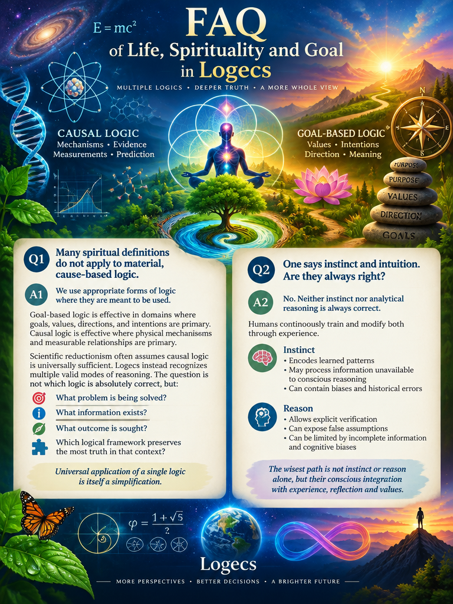

 

# FAQ of Life, Spirituality and Goal in Logecs

## Q1: many spiritual definitions do not apply to material, cause-based logic.

A1: we use appropriate forms of logic where they are meant to. Goal-based logic is effective in it's domain, and used where goal-based definitions are given, which is scientific - causal logic as universal scientific logic is fundamental simplification, especially with many things people do not solve with it.

## Q2: one says instinct, intuition, but is it always right?

A2: we develop our instincts and intuitions based on feedback and learn about particular aspects of truth. Extremism like telling intuition and instinct are correct or wrong are not for us - experience is used to discriminate and use each force in suiting context.

## Q3: but does modern shamanistic spirituality attune to matter in it's physical degree?

A3: if definitions are given based on evolutionary alignment of spirit as higher-degree, physically compatible law, extremism is also avoided - it's not possible it's *against* natural laws in survival, but it's clearly defined it's not complete. Naïve vegetism is to *ask* questions: definitions, which state naturalism here goes in physical complete, must be followed with physical completeness, not some given "spiritualism" assumed - spiritualism is methodologies to bring higher terms and scopes closer to one's solutions, and if it does not fit material flow it might be flawed, and to assume it ever completely does is to fail seeing how separate complexities might be separated.

## Q4: does thing X exist, metaphysically?

In particular, successful answer the philosophical open questions are often answered by probability etc. This kind of scientific attempts are naïve.

Rather, Laegna asks:
- What these particular X's would be, what it matters if it exists or not?
- What are the particular aspects of it's existance and areas.
- Given models where they exist or not, reach the real-life implications.

Religious, spiritual, scientific models:
- They are made consistent inherently, or inconsitencies are reasoned.
- They are executed until reaching the particular, actual consequences.
- Aspects which are not measureable, are left open and particular consequences solved.

For example, one has a computer and asks, whether it's AMD or Intel. Only thing inside is platform-independent programming language which never reports that. One must decide about bunch of engineering decisions, which still relate - speed of certain routines vs. certain others etc., but the statistics does not completely uncover the model because it's not a standard language. One does all the proper measurements for their application, writes down the major points which might hint one or another model, and creates the identical result based on two model assumptions; finally in careful language the few places where words might be different are rephrased to meet both definitions.

This is how Laegna works: this is nonsense to tell me about the probabilities of X or not X giving some particularly "better" answers because:
- I only include the basis for such probabilities.
- I do not include any round single boolean singletons which would relate them;
  - For example God is love and love exists => does not give "God exists", but gives feature-based analysis of some models.
  - God is final infinity angle and future integral attractor => partial definition for both God and non-God are given; in some models these are identical, in others they overlap, yet other models do not see any evidence of God in calculations about such orders, ranks and angles. This is then the definition: God *as a* final angle or final angle without God would prove that / (the particulars follow) /. I am not supposing to close any other particulars and rather than explaining me how sad is life without probability calculus and alternative branches, one should show me *only* the actual evidence in life or it's goals, which would differ.
  - It's not random that existing paradigms and models give *the same* reality after a few steps - rather, they give the *reality which was initially measured* with *parameter-model relations set so that parameters cancel out what model seems to wrongly assume*, for example Christians can still be seen living material lives, scientist finds some feeling of sacred somewhere, and so on - sometimes, model provides one, but reality points to specific exceptions despite. Coffee might be healthy or not, but a specific situation might reason it; nature might not be sacred and holistic for some, but they still use similar reasoning against nuclear war and call it certain: they suddenly *are* finding something resembling "sacred".

## Q5: aura vision connections to reality are under question.

A5: we train vision and brain integrity and use feedback to modify it's assumptions; visions appear of all kinds and relate to reality by different means, we study those relations. To get visual insight into actual information of the system, or to get symbolic visual - one is successful visual approach, the other needs particular separation of material and symbolic. In any case, I don't need "answers" - human as neuroflexible, self-programmable and evolving system is deep enough; seeing "chakras" - for example my own visionary mind does not project Lotus flowers but rather 3D map, but I can see precisely how Buddha associates energies and areas - my senses are rather scientific than symbolic; I could create vivid symbolic realm in my mind and they could become actual flowers - in this case I would see right if I can separate symbolic from material, or wrong if I am not. Statement that stuck logic into paradox will be ultimate solution will not.

## Q5: does spiritual world exist?

A5: the world inside our minds, their connections, and inside how matter relates to mind as living environment; as well as long term and wide propagation gains are higher ranks are true. Questions which want to somehow equate something in this to draw direct relations between material and spiritual are non-discrete, unable to concentrate on parallel, interacting, yet different systems; others are not good enough to understand exact power of long term and how short terms are still there, and their vivid pain does not unyield the long - one is gone, the other as well.

The other aspect is the *cognitive*, internal sensations, visions - we feel inside, this is another realm.

Symbolic, spiritual, mental realms are defined by study of consciousness:
- They are not material in direct sense, but they still exist and thus are interesting.
- To study them means, first, to put them to the right place.

---

CoPilot's extended version of the FAQ:

# FAQ of Life, Spirituality and Goal in Logecs

## Q1: Many spiritual definitions do not apply to material, cause-based logic.

A1: We use appropriate forms of logic where they are meant to be used.

Goal-based logic is effective in domains where goals, values, directions and intentions are primary. Causal logic is effective where physical mechanisms and measurable relationships are primary.

Scientific reductionism often assumes causal logic is universally sufficient. Logecs instead recognizes multiple valid modes of reasoning.

The question is not which logic is absolutely correct, but:

- What problem is being solved?
- What information exists?
- What outcome is sought?
- Which logical framework preserves the most truth in that context?

Universal application of a single logic is itself a simplification.

---

## Q2: One says instinct and intuition. Are they always right?

A2: No.

Neither instinct nor analytical reasoning is always correct.

Humans continuously train and modify both through experience.

Instinct:
- Encodes learned patterns.
- May process information unavailable to conscious reasoning.
- May contain biases and historical errors.

Reason:
- Allows explicit verification.
- Can expose hidden assumptions.
- Can become detached from practical realities.

Logecs rejects:

- "Always trust intuition."
- "Never trust intuition."

Instead:

- Observe.
- Test.
- Learn.
- Differentiate contexts.

Truth emerges through feedback between intuition, experience, and analysis.

---

## Q3: Does modern spirituality properly account for physical reality?

A3: Sometimes yes, sometimes no.

If a spiritual model claims compatibility with nature, evolution, ecology or survival, then those claims should also be examined physically.

Spirituality is not exempt from reality.

Likewise, physical science is not exempt from questions of meaning.

Logecs treats spirituality as:

- A methodology for connecting larger scales.
- A framework for value.
- A cognitive technology.
- A means of organizing consciousness.

A spiritual model that repeatedly predicts failure in reality may require revision.

A material model that ignores consciousness, values and goals may also be incomplete.

---

## Q4: Does X exist metaphysically?

A4: This is often an incorrectly framed question.

Typical approaches ask:

- Does X exist?
- What is the probability X exists?

Logecs asks:

- What exactly is X?
- Which properties define X?
- In what domain would X exist?
- What consequences differ if X exists or does not exist?

The focus shifts from abstract existence toward observable implications.

Models are developed both ways:

- Assume X exists.
- Assume X does not exist.

The consequences are then followed into practical reality.

Questions that produce no consequences may remain open.

---

## Q5: What is the role of probability in spiritual and philosophical questions?

A5: Probability is useful but not ultimate.

Probability calculations depend on assumptions.

If assumptions are unclear, probabilities may simply disguise uncertainty.

Logecs therefore seeks:

- Explicit assumptions.
- Defined models.
- Concrete consequences.

Probability is then applied where appropriate without granting it metaphysical authority.

---

## Q6: Are religious, spiritual and scientific models contradictory?

A6: Not necessarily.

Many apparent contradictions originate from:

- Different definitions.
- Different scales.
- Different goals.
- Different levels of abstraction.

Models should first be translated into comparable forms.

After translation:

- Some differences disappear.
- Some become genuine disagreements.
- Some become questions of emphasis.

Reality itself remains the common reference.

---

## Q7: Are symbolic visions, aura perception and inner imagery real?

A7: The experience is real.

The interpretation remains a separate question.

Logecs distinguishes:

1. The vision.
2. The meaning assigned to the vision.
3. The external reality potentially related to the vision.

A symbolic image may:

- Represent emotional information.
- Represent subconscious organization.
- Represent cognitive compression.
- Coincide with external events.

These possibilities should not be confused.

The ability to experience vivid symbolic worlds does not automatically prove physical claims about them.

Likewise, the existence of symbolism does not invalidate its usefulness.

---

## Q8: Does the spiritual world exist?

A8: Yes, if properly defined.

The spiritual world may refer to:

- Inner experience.
- Meaning structures.
- Values.
- Intentions.
- Relationships.
- Symbolic systems.
- Conscious experience.

These phenomena exist as realities of consciousness regardless of metaphysical interpretation.

Logecs therefore studies:

- How consciousness experiences them.
- How they interact with physical systems.
- How they influence behavior and development.

Existence need not imply materiality.

---

## Q9: What is consciousness?

A9: Consciousness is not reduced to a single definition.

Several complementary perspectives may be used:

- Subjective awareness.
- Integrated processing.
- Self-modeling systems.
- Recursive observation.
- Goal-directed adaptation.

Logecs treats consciousness as a phenomenon requiring multiple simultaneous descriptions.

No single paradigm currently explains all aspects.

---

## Q10: Does free will exist?

A10: The question depends on scale.

At some levels:

- Systems appear determined.

At other levels:

- Choice emerges through complexity, feedback and self-reference.

Logecs replaces the binary question:

"Free will or no free will?"

with:

"What forms of choice become available at different levels of organization?"

Freedom therefore becomes a graded property rather than an absolute.

---

## Q11: What is the purpose of life?

A11: There may not be a universal purpose imposed from outside.

However:

Living systems naturally generate goals.

Humans generate:

- Meanings.
- Values.
- Stories.
- Futures.

Purpose may therefore be:

- Discovered.
- Constructed.
- Evolved.
- Shared.

Logecs studies how purposes emerge rather than assuming a single final answer.

---

## Q12: Is suffering meaningful?

A12: Suffering exists before interpretation.

Meaning arises afterward.

Not all suffering is useful.

Not all suffering is pointless.

Questions include:

- What caused it?
- What adaptations follow?
- What lessons emerge?
- What should be prevented in the future?

Logecs avoids both extremes:

- Glorifying suffering.
- Dismissing suffering.

Its significance depends on consequences and context.

---

## Q13: What is spiritual development?

A13: Spiritual development is the increase of awareness across wider scales.

It includes:

- Self-understanding.
- Emotional integration.
- Ethical reasoning.
- Long-term thinking.
- Improved perception of relationships.

Development is measured not by belief but by capability.

The question is not:

"What does one claim to know?"

but:

"What complexities can one meaningfully integrate?"

---

## Q14: What is enlightenment?

A14: Enlightenment is not treated as a magical endpoint.

Instead it may represent:

- Reduced confusion.
- Greater integration.
- Increased coherence.
- Better perception of reality.
- Improved alignment between thought and action.

Multiple degrees and forms may exist.

No finite individual completely contains infinite reality.

---

## Q15: What is truth?

A15: Truth exists in multiple forms.

Examples include:

- Physical truth.
- Logical truth.
- Statistical truth.
- Functional truth.
- Symbolic truth.
- Experiential truth.

Mistakes occur when one truth category is incorrectly applied to another.

Logecs studies relations among truth types rather than reducing all truth to a single category.

---

## Q16: What is God?

A16: Logecs does not begin by asserting or denying God.

Rather it asks:

What properties are being referred to?

Examples include:

- Ultimate cause.
- Final attractor.
- Infinite being.
- Universal consciousness.
- Moral source.
- Cosmic order.

Different traditions define different entities under the same word.

Each definition should be analyzed separately.

The consequences of each model are then followed through reality.

Agreement or disagreement emerges from particulars rather than slogans.

---

## Q17: What survives death?

A17: Multiple independent questions exist.

For example:

- Do memories survive?
- Do influences survive?
- Do informational structures survive?
- Does subjective awareness continue?
- Do social consequences persist?

Logecs treats these independently.

Some may be measureable.

Some may remain open.

All should be clearly distinguished.

---

## Q18: What is wisdom?

A18: Knowledge accumulates information.

Wisdom organizes action.

A wise system:

- Distinguishes scales.
- Balances competing truths.
- Predicts consequences.
- Learns from errors.
- Preserves adaptability.

Wisdom is therefore not merely knowing more.

It is integrating more without becoming rigid.

---

## Q19: What is the highest goal?

A19: Logecs does not assume a single highest goal.

Possible candidates include:

- Survival.
- Flourishing.
- Understanding.
- Beauty.
- Love.
- Freedom.
- Harmony.
- Expansion of consciousness.

Different systems weight these differently.

The study concerns:

- Their relationships.
- Their conflicts.
- Their possible synthesis.

---

## Q20: What is the common post-mythos?

A20: The common post-mythos is not the destruction of myth.

It is the ability to understand:

- Myth.
- Science.
- Consciousness.
- Symbolism.
- Rationality.
- Spirituality.

within a shared framework.

Myths become models.

Models become tools.

Tools become evaluated through consequences.

The goal is not replacing one dogma with another.

The goal is increasing the capacity to navigate reality across multiple layers simultaneously.
