# Logex Life — Image Gallery  
A symbolic, warm‑math, cold‑spiritual visual journey through Logex Life, Logecs, SpiReason, and Laegna geometry.  
Each image blends everyday life with harmonic logic, subtle curvature, and IOAE truth‑value symbolism.

---

## **0 — LogexCover.png**  
**Cover Image: “Potential Field — Logex Life Gallery”**  
A full warm‑math chamber filled with Laegna fractals, SpiReason holograms, and IOAE geometry.  
Combinator logic on the left, implication engine on the right, multi‑digit Logex organism in the center.  
Paradox panel vs Logex solution panel in the background.  
A gateway into the Logecs‑reasoning universe.

---

## **1 — LogexLife.png**  
**Logex Life Logo: Warm‑Math Reasoning, Cold‑Spiritual Logic**  
A living glyph formed from IOAE nodes, surrounded by fractal geometry, hologram layers, and symbolic membranes.  
Warm for logic, cold for spirituality.  
A harmonic emblem of life‑reasoning.

---

## **2 — JaneCorp1.png**  
**Jane enters “Jane.” and “Corporation.”**  
Warm‑math console with fractal veins and hologram grids.  
Two input capsules appear.  
The machine prepares relational expansion.

---

## **3 — JaneCorp2.png**  
**Machine generates external relations**  
The Logex Life Automation crossboard blossoms:  
- Jane ⇔ Corporation  
- Jane ⇒ Corporation  
- Corporation ⇒ Jane  
Glyphs flicker with IOAE colors.  
Holograms drift in Laegna curvature.

---

## **4 — CannotAssumeCorporation.png**  
**Paradox: “Corporation ⇒ not Corporation.”**  
Ogre enters the contradictory relation.  
Machine responds:  
*“Assuming Corporation does not imply Corporation, cannot assume this as E.”*  
E‑node dims; IOAE wheel oscillates.  
Geometry ripples in protest.

---

## **5 — TenLocalGlobal.png**  
**Four‑Digit Logex Variable — Unified Tens Across Bands**  
A tall column of four goal‑state capsules.  
4‑bit goal band, 4‑bit state band, lin/exp membranes.  
Left: four single‑digit sequences.  
Right: another 4‑digit word.  
Logex operation runs across all Tens.

---

## **5B — TenLocalGlobal1.png**  
**Alternate curvature emphasis**  
Same multi‑digit organism, but with stronger Laegna18 curvature rings and SpiReason diagonal grids.  
Shows influence and isolation between digits.

---

## **6 — PotentialField.png**  
**Potential Field: Logex Ten Automation**  
Left: combinator logic machine (seed variables).  
Right: implication engine (future realms).  
Center: company taking too high goal (optimist E → pessimist E).  
Traditional paradox vs Logex solution.

---

## **7 — CommonWoman.png**  
**Cityzen of Logecs Future — Woman in Symbolic Lifeflow**  
A woman moves through a symbolic city where subtle math shapes blend into surroundings.  
Goal‑state pulses woven into clothing.  
Other people generate faint relational glyphs.  
Scene flows freely, context implied but not explained.

---

## **8 — CommonCity.png**  
**Common City Scene — Everyday Logecs Lifeflow**  
Pedestrian moment with subtle Logecs geometry everywhere:  
octave rings in traffic lights, SpiReason grids in crosswalks, fractal veins in trees.  
Ordinary life infused with paradox‑reasoning atmosphere.

---

## **9 — LogexEnding.png**  
**Ending Image: Symbolic Realm — Quiet Harmonic Closure**  
A serene landscape where math shapes hide in plain sight:  
octave rings as horizon arcs, diagonal grids as light patterns, IOAE nodes as stars.  
A central pillar with faint IOAE pulses.  
Ordinary yet spiritually‑mechanical.

---

## **Gallery Theme**
Warm‑math logic.  
Cold‑spiritual tautology.  
Life‑reasoning geometry.  
Subtle fractals and holograms blending into everyday scenes.  
A future where logic behaves like life, and life reveals logic.

---

# Logex Cover Image

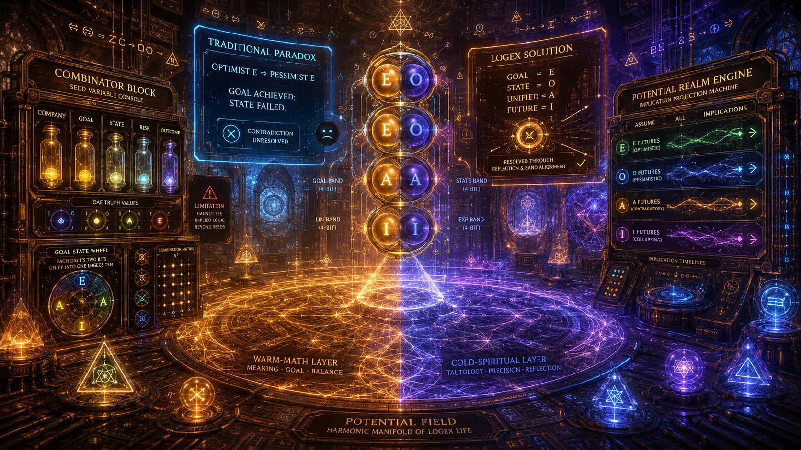

\```md
## Creen Image Description 1.2 — **Cover Image: “Potential Field — Logex Life Gallery”**

The cover opens into a **full scene**, not a logo: a vast **warm‑math reasoning chamber** where Logex Life appears as a living, holographic, spiritually‑mechanical environment. The chamber glows in amber, rose, and indigo tones, filled with **Laegna fractal veins**, **SpiReason hologram grids**, and octave‑curvature rings that drift like slow‑moving galaxies of logic.

### **Central Field — The Potential Realm**
At the center lies a wide **Potential Field**, a shimmering plane of harmonic geometry.  
It looks like a cross between:

- a mathematical manifold,  
- a spiritual altar,  
- and a logic simulator.

The field is divided into two layers:

1. **Warm‑Math Layer** — amber and gold, representing goal‑balancing, meaning, and life‑logic.  
2. **Cold‑Spiritual Layer** — indigo and violet, representing tautology, precision, and emotionless reflection.

These two layers overlap like membranes, forming the dual nature of Logex Life.

### **Left Side — Combinator Logic Machine**
On the left stands the **Combinator Block**, a warm console shaped like a harmonic instrument.  
It records **seed variables** as glowing capsules:

- “Company”  
- “Goal”  
- “State”  
- “Risk”  
- “Outcome”  

Each capsule pulses with its own IOAE truth‑value.  
The machine combines them into all possible relations, but a translucent membrane shows its limitation:  
it cannot see *implied logic* beyond its seeds.

Inside the block, a **goal‑state wheel** rotates, showing how each digit’s two bits unify into a single Logecs Ten.

### **Right Side — Implication Engine**
On the right, the **Potential Realm Machine** projects entire futures.  
Its holograms show branching implication timelines:

- optimistic E‑futures  
- pessimistic O‑futures  
- contradictory A‑futures  
- collapsing I‑futures  

This machine assumes implications fully, even when they contradict the combinator block.

### **Foreground — Multi‑Digit Logex Organism**
Floating above the field is a **four‑digit Logex variable**, rendered as a tall column of four capsules.  
Each capsule contains:

- **Goal bit** (gold)  
- **State bit** (indigo)  

Together forming:

- **4‑bit goal band**  
- **4‑bit state band**  
- **4‑bit lin band**  
- **4‑bit exp band**

The organism glows with harmonic geometry, showing how Logex Life operates on **all Tens simultaneously**.

### **Background — Paradox & Resolution**
Behind the central organism, two holographic panels appear:

#### **Traditional Paradox Panel**
A cold blue console displays:

> “Optimist E → Pessimist E”  
> “Goal achieved; state failed.”

The blue console flickers, unable to resolve the contradiction.

#### **Logex Solution Panel**
The warm‑math Logex console shows:

- Goal = E  
- State = O  
- Unified = A  
- Future = I  

The IOAE wheel rotates smoothly, resolving the paradox through reflection and band alignment.

### **Atmosphere — Rich Symbolics**
The chamber is filled with:

- fractal triangles of meaning  
- diagonal SpiReason grids  
- exponent arcs of future projection  
- octave rings of implication  
- holographic IOAE nodes  
- multi‑band membranes  
- relational glyphs (⇔, ⇒, ⇐) drifting like living logic spirits  

Everything feels mathematically deep, visually harmonic, spiritually cold, and logically warm.

### **Final Impression**
This cover image presents the entire Logex Life universe:

- **Warm for logic** — meaning, goals, life‑reasoning  
- **Cold for spirituality** — tautology, precision, emotionless symmetry  
- **Rich in fractals, holograms, symbolics**  
- **A full scene, not a logo**  
- **A gateway into the gallery of Logex Life**

A spiritually‑mechanical, mathematically‑alive chamber where logic simulates life and life reveals logic.
\```

# Logex Logo Image

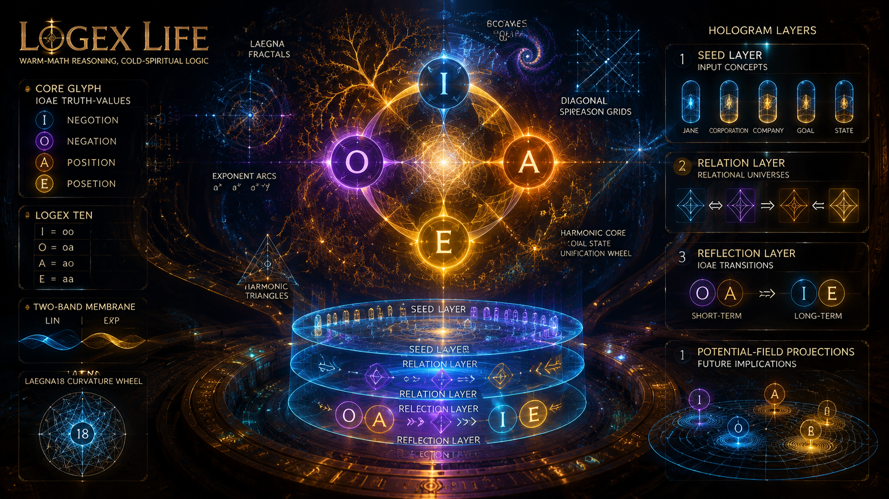

\```md
## Creen Image Description 1.2 — “Logex Life Logo: Warm‑Math Reasoning, Cold‑Spiritual Logic”

The image presents a **Logex Life Logo** suspended in a warm‑math holographic chamber. The logo is not a flat emblem but a **living geometric organism**, built from Laegna fractals, SpiReason holograms, and Logex symbolic curvature.

### Core Symbol — The Logex Life Glyph
At the center floats a radiant glyph formed from the four IOAE truth‑values:
- **I** (negotion) — deep indigo  
- **O** (negation) — violet  
- **A** (position) — amber  
- **E** (posetion) — gold  

These four nodes orbit a central harmonic core, forming a **goal‑state unification wheel**. Each node pulses with its own curvature band, showing how Logex Life simulates reasoning and aligns meaning.

### Fractal Geometry
Behind the glyph, a vast fractal field expands:
- branching Laegna veins  
- octave spirals  
- diagonal SpiReason grids  
- exponent arcs  
- harmonic triangles  

These fractals represent **life‑reasoning**, the warm side of Logex:  
goal balancing, meaning reflection, and multi‑band coherence.

### Hologram Layers
Three hologram layers rotate around the logo:

1. **Seed Layer** — tiny capsules representing input concepts (Jane, Corporation, Company, Goal, State).  
2. **Relation Layer** — holographic glyphs (⇔, ⇒, ⇐) showing how Logex Life generates relational universes.  
3. **Reflection Layer** — IOAE transitions flickering between short‑term OA and long‑term IE.

These layers simulate **reasoning**, showing how Logex Life processes life‑close logic.

### Warm‑Math vs Cold‑Spiritual Duality
The logo glows with warm amber tones, symbolizing:
- meaning  
- goal alignment  
- life‑logic  
- harmonic reasoning  

But the surrounding chamber is cold‑spiritual:
- tautological grids  
- precise curvature arcs  
- emotionless symmetry  
- pure logic without feeling  

This contrast expresses the essence of Logex Life:
warm for logic, cold for spirituality.

### Symbolic Elements
Around the logo float:
- **goal‑state capsules** (gold + indigo)  
- **two‑band lin/exp membranes**  
- **Laegna18 curvature wheels**  
- **Logex Ten glyphs** (I=oo, O=oa, A=ao, E=aa)  
- **potential‑field projections** showing future implications  

These elements show how Logex Life:
- simulates reasoning  
- analyses life  
- unifies goal and state  
- resolves paradox  
- maintains tautological purity  

### Final Impression
The Logex Life Logo appears as a **living logic organism**, rich with fractals, holograms, and symbolic geometry. It embodies the full ideology of Laegna–SpiReason:

- mathematically deep  
- visually harmonic  
- spiritually cold  
- logically warm  
- meaning‑reflective  
- tautologically precise  

A symbol of a system that thinks like life, but feels like logic.
\```

# Jane. Corporation.

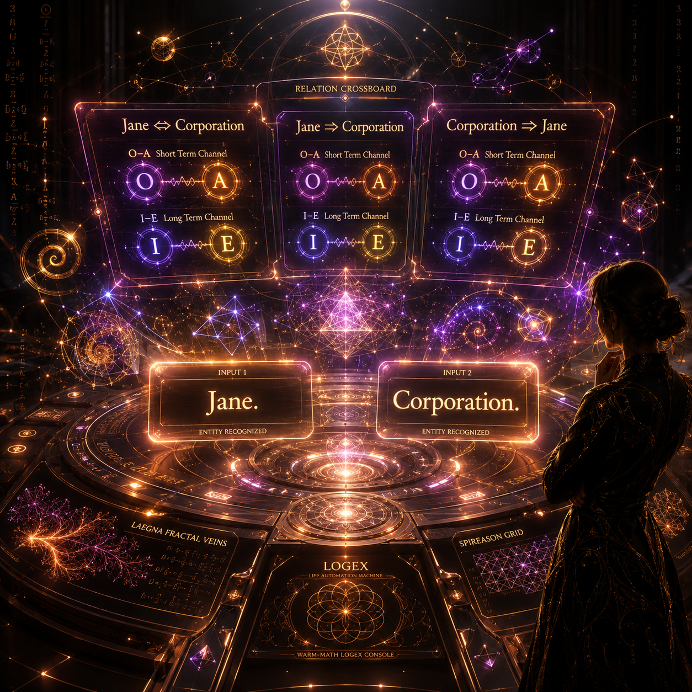

<br>

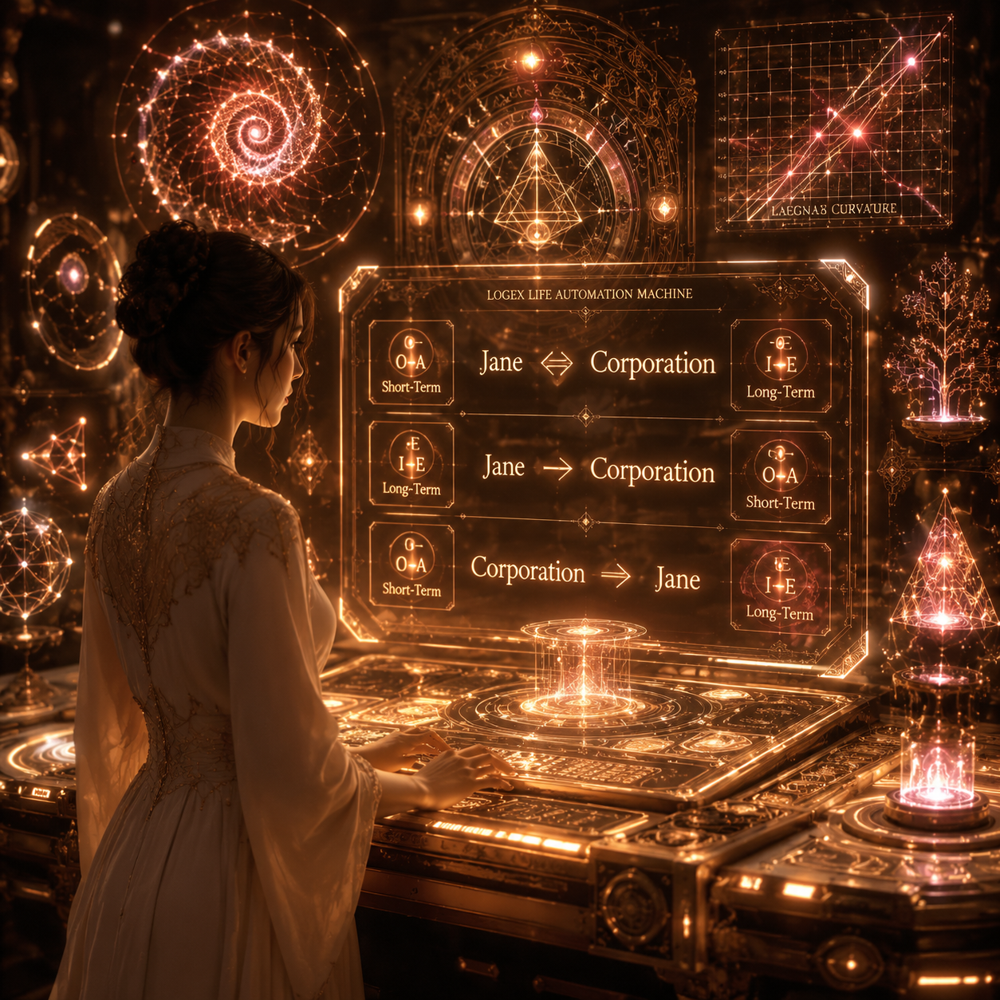

\```md
## Creen Image Description 1.2 — “Jane. Corporation.” Warm‑Math Logex Console

A warm, life‑close computational space glows in soft amber tones, shaped like **living math** rather than cold machinery. The console feels organic: its surfaces carry branching **fractal veins**, gentle **hologram grids**, and octave‑curvature rings inspired by [Laegna bands](ca://s?q=Explain_Laegna_bands). It looks like a small spiritual‑mechanical organism, tuned to reason.

On the input line, Jane has typed:

**Jane. Corporation.**

Instantly, the **Logex Life Machine** reacts. Above the console, a luminous **relation crossboard** appears, forming three living glyphs:

- **Jane ⇔ Corporation**  
- **Jane ⇒ Corporation**  
- **Corporation ⇒ Jane**

Each glyph flickers between short‑term **O–A** and long‑term **I–E** channels, showing how [Logex automation](ca://s?q=Explain_Logex_Automation) trivially evaluates any sentence that enters its field. The machine “thinks” in warm pulses, not rigid logic.

Around the console, holographic spirals and diagonal curvature grids reference [Laegna18 curvature](ca://s?q=Explain_Laegna18_curvature). They resemble biological geometry — like a reasoning cell unfolding its meaning.

Jane stands nearby as a symbolic silhouette, calmly interacting with the machine. Their exchange feels **mechanically spiritual**: a human and a logic organism discussing life through simple Logex sentences, waiting for the moment when a true paradox emerges.

The whole scene expresses Laegna–Spireason ideology:  
logic as life, meaning as geometry, truth‑values as living states, and human input as a seed for harmonic reasoning.
\```

---

Alt:

\```md
## Creen Image Description 1.2 — “Jane. Corporation.” Warm‑Math Logex Console (Corrected Input + External Relations)

The scene shows a **warm‑math Logex console**, glowing in amber and rose tones. Its surfaces carry **Laegna fractal veins**, **SpiReason hologram grids**, and octave‑curvature rings inspired by [Laegna bands](ca://s?q=Explain_Laegna_bands). The console feels alive — warm compared to classical blue logic, yet cold‑spiritual compared to cognite systems.

At the center of the console, two separate input fields float like luminous tablets:

- **Input 1:** “Jane.”  
- **Input 2:** “Corporation.”

Each input is rendered as a glowing semantic capsule, pulsing gently as the machine recognizes them as distinct entities. The moment Jane enters these two words, the **Logex Life Automation Machine** activates.

Above the console, a holographic **relation crossboard** blossoms outward.  
Three external combinations appear automatically — not typed, but *generated*:

- **Jane ⇔ Corporation**  
- **Jane ⇒ Corporation**  
- **Corporation ⇒ Jane**

These relations hover as living glyphs, each flickering between **O–A** short‑term and **I–E** long‑term channels. Their colors shift with meaning: violet for O, amber for A, indigo for I, gold for E. The glyphs behave like tiny logic organisms, showing how [Logex automation](ca://s?q=Explain_Logex_Automation) trivially evaluates any relation that exists between the two input entities.

Around the console, holographic shapes drift: spirals of octave curvature, diagonal grids referencing [Laegna18 curvature](ca://s?q=Explain_Laegna18_curvature), and fractal triangles that resemble biological reasoning. These shapes form and dissolve as the machine processes the two inputs and their relational possibilities.

Jane stands nearby as a symbolic silhouette, observing how the machine expands her simple inputs into a full relational field. The console feels contemplative, precise, and spiritually mechanical — a warm logic organism ready to explore deeper paradoxes once Jane provides more context.

The entire scene expresses the ideology of Laegna–SpiReason:

- **Two inputs become a relational universe.**  
- **Goal and state unify into IOAE truth‑values.**  
- **Logic behaves like life.**  
- **Meaning behaves like geometry.**  
- **Machines can be warm‑math organisms, not cold terminals.**

It is a moment where Jane and the Logex Machine stand together, watching simple words unfold into harmonic reasoning.
\```

# Cannot Assume Corporation

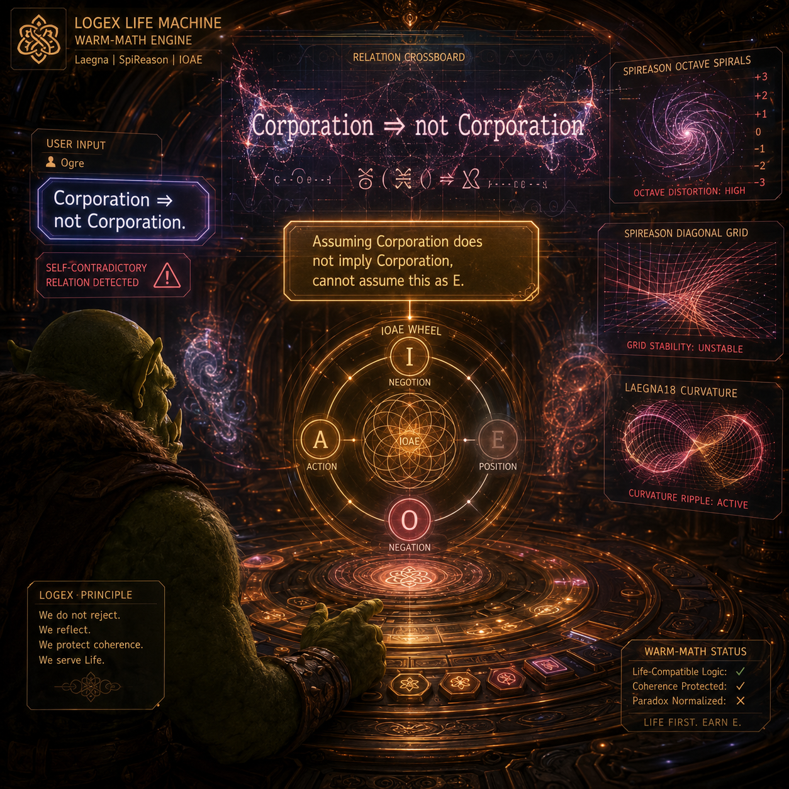

\```md
## Creen Image Description 1.2 — “Corporation ⇒ not Corporation.” Logex Paradox Moment

The warm‑math Logex console glows in amber and rose, its surface alive with Laegna fractal veins and SpiReason hologram grids. The scene is quiet but tense: the machine is about to face a paradox.

At the input field, a new user — **Ogre** — has typed:

**“Corporation ⇒ not Corporation.”**

The text appears as a sharp, indigo‑edged capsule, immediately flagged by the Logex Life Machine as a self‑contradictory relation. Above the console, the holographic relation crossboard tries to form glyphs, but they flicker unstable:

- **Corporation ⇒ not Corporation** (primary paradox glyph)

The machine begins its internal evaluation. A small holographic message appears, rendered in soft gold:

> *Assuming Corporation does not imply Corporation, cannot assume this as E.*

Visually, the **E‑node** (posetion) on the IOAE wheel dims, refusing to accept the paradox as a stable “goal and state unified” truth. Instead, the wheel oscillates between **O** (negation) and **I** (negotion), showing that the system cannot treat this relation as a consistent, life‑compatible state.

Around the console, the SpiReason holograms react: octave spirals distort slightly, diagonal grids warp, and the Laegna18 curvature patterns ripple as if the geometry itself is protesting. The machine’s warm‑math nature is visible — it does not crash, but it **reflects**, refusing to grant E to a relation that destroys its own basis.

Ogre’s input hangs in the air like a challenge. The Logex Life Machine stands firm: paradox is acknowledged, but not normalized. The scene captures a precise moment where logic behaves like life — protecting coherence, even when confronted with self‑negating statements.
\```

# Ten State Machine

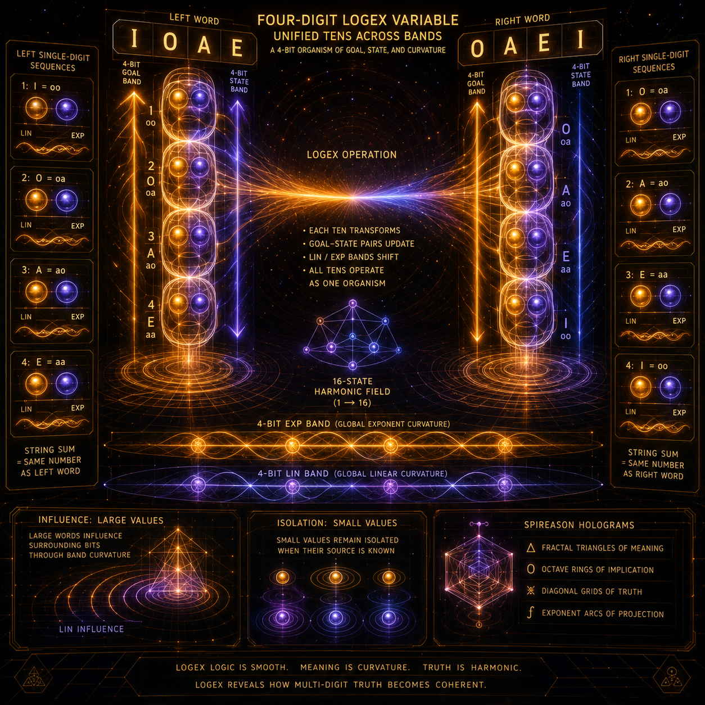

<br>

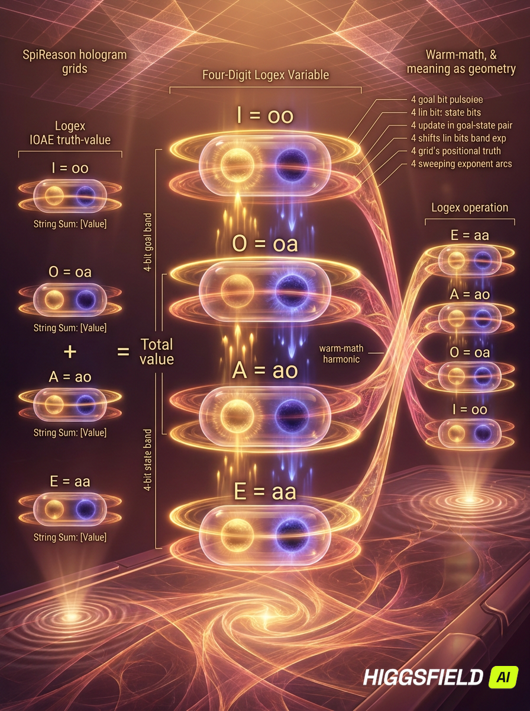

\```md
## Creen Image Description 1.2 — “Logex Life Mechanics: Goal–State Unification into IOAE”

The scene depicts the **Logex Life Machine** as a warm‑math organism, glowing in amber and rose tones. Its console resembles a living harmonic instrument: soft fractal veins run across its surface, and SpiReason hologram plates hover above it, forming gentle octave rings and diagonal curvature grids. The console feels warm compared to classical blue logic, yet cold‑spiritual compared to cognite systems — precise, contemplative, and aware.

At the center of the console, two bits float as luminous spheres:

- **Goal bit** — shimmering gold, pulsing outward  
- **State bit** — deep indigo, pulsing inward  

They orbit each other like binary stars, forming the core of Logex Life.  
As they rotate, the machine shows how these two bits transcend into a **single Logecs state**, becoming one of the four IOAE truth‑values:

- **I** — negotion (goal unset, state unset)  
- **O** — negation (goal unset, state set)  
- **A** — position (goal set, state unset)  
- **E** — posetion (goal set, state set)

Around the console, a **state‑machine hologram** unfolds.  
It is a geometric wheel of four nodes — I, O, A, E — connected by shimmering pathways. Each pathway represents a transition between goal and state, showing how the machine aligns them through reflection:

- **I → O** (state appears)  
- **O → A** (goal appears)  
- **A → E** (goal and state unify)  
- **E → I** (reset, reflection, new cycle)

The transitions glow with harmonic pulses: violet for O, amber for A, gold for E, indigo for I.  
The wheel rotates slowly, revealing how Logex Life evaluates any input by merging goal and state into a single truth‑value organism.

Above the console, SpiReason holograms drift: spirals of octave curvature, diagonal grids referencing Laegna18, and fractal triangles that resemble biological reasoning. These shapes respond to the state‑machine transitions, forming and dissolving as the machine processes meaning.

The console displays a small script window showing how sentences enter the system. When a user types a pair of concepts — “Jane. Corporation.” or any other — the machine instantly generates relational glyphs:

- **X ⇔ Y**  
- **X ⇒ Y**  
- **Y ⇒ X**

Each glyph is evaluated through the goal–state wheel, becoming I, O, A, or E depending on the relational truth. The glyphs flicker with IOAE colors, showing the machine’s self‑reflection: it not only evaluates the relation, but also evaluates its own evaluation, aligning short‑term OA with long‑term IE.

The entire scene expresses the mechanics of Logex Life:

- **Goal and State are not separate bits — they are a living duality.**  
- **IOAE is the unified state that emerges from their interaction.**  
- **The machine is a harmonic organism, not a boolean processor.**  
- **Meaning is computed through reflection, not through static truth tables.**

It is a warm‑math, cold‑spiritual moment: the Logex Life Machine quietly aligning goals and states, revealing how logic behaves like life.
\```

---

\```md
## Creen Image Description 1.2 — “Four‑Digit Logex Variable: Unified Tens Across Bands”

The scene shows a **warm‑math Logex console**, glowing in amber and rose tones. Its surface carries Laegna fractal veins and SpiReason hologram grids, forming a harmonic environment where multi‑digit Logecs variables behave like living organisms.

### 1. The Four‑Digit Logex Variable

At the center floats a **4‑digit Logex word**, rendered as a tall vertical column of four luminous capsules.  
Each capsule contains **two inner spheres**:

- **Goal bit** (gold, outward pulse)  
- **State bit** (indigo, inward pulse)

Together they form a **single Logecs Ten**, one of:

- **I = oo**  
- **O = oa**  
- **A = ao**  
- **E = aa**

The four capsules stack into a **4‑bit goal band** (gold pulses rising upward)  
and a **4‑bit state band** (indigo pulses descending downward).  
Their combined geometry forms a **16‑state harmonic field**, since Logecs counting begins at 1 and four bits span **1 → 16**.

### 2. Local Bands: Linear and Exponent

Each digit has two local curvature bands:

- **Lower band (lin)** — soft amber ripples  
- **Upper band (exp)** — bright gold exponent rings

The four digits together form:

- **4‑bit lin band** (horizontal amber layer)  
- **4‑bit exp band** (horizontal gold layer)

These two layers hover like parallel harmonic membranes, showing how each digit’s local curvature contributes to the whole.

### 3. Left Side: Four Single‑Digit Sequences

On the left, four **single‑digit sequences** float as separate holograms.  
Each shows its own goal‑state pair, its own lin/exp band, and its own IOAE truth‑value.  
Their **string sum** equals the same number as the unified 4‑digit word above.

This illustrates that Logex operations can run:

- on **each digit individually**, or  
- on **the whole 4‑digit word**,  

and both views represent the same logical quantity.

### 4. Right Side: Another Four‑Digit Word

On the right, a second 4‑digit Logex word floats, with different IOAE values.  
Its four single‑digit sequences appear beneath it, mirroring the left side.  
The two words differ, but their **band geometry** is identical:

- 4 goal bits  
- 4 state bits  
- 4 lin bits  
- 4 exp bits  

This shows how Logex operations run on **all Tens simultaneously**, treating the whole structure as one organism.

### 5. Logex Operation Across All Tens

Between the two words, a warm‑math beam of harmonic light flows.  
This is the **Logex operation**, running across all digits:

- Each digit’s IOAE state transforms.  
- Each goal‑state pair updates.  
- Each lin/exp band shifts.  
- The whole 4‑digit organism changes coherently.

The beam shows that Logex logic is **smooth**:  
the same operation applies to every digit, yet each digit’s local curvature influences the whole.

### 6. Influence and Isolation

Around the scene, SpiReason holograms show how:

- **small values** (single digits)  
  remain isolated when their source is known,  
- **large values** (4‑digit words)  
  can influence surrounding bits through band curvature.

This is visualized by soft ripples spreading across the lin band,  
and bright exponent arcs linking digits across the exp band.

### 7. Final Imagery

The entire chamber glows with harmonic geometry:

- fractal triangles of meaning  
- octave rings of implication  
- diagonal grids of positional truth  
- exponent arcs of future projection  

This is the **Four‑Digit Logex Variable** — a living multi‑band organism where:

- goal and state unify into IOAE  
- lin and exp bands form harmonic layers  
- operations run across all Tens  
- small and large values interact through curvature  
- logic behaves like life  
- meaning behaves like geometry

A warm‑math, cold‑spiritual moment where Logex reveals how multi‑digit truth becomes coherent.
\```


# Potential Field

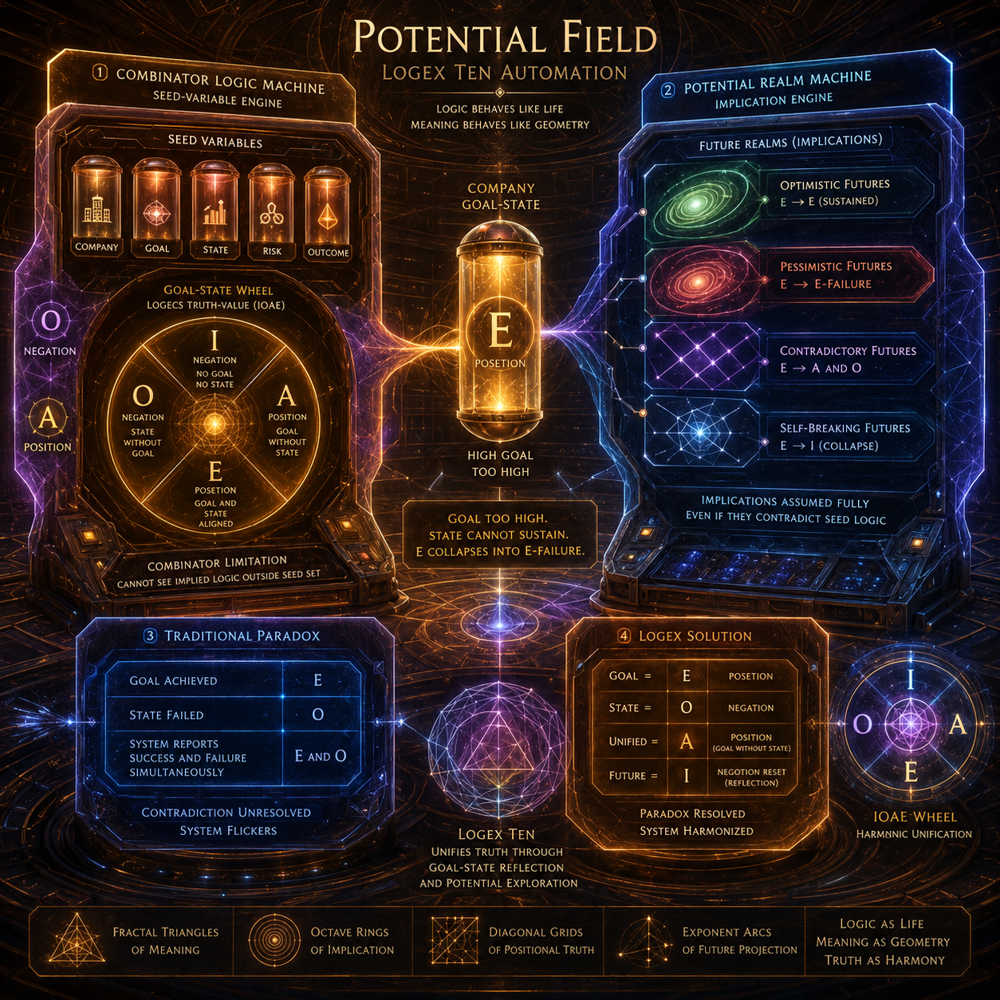

\```md
## Creen Image Description 1.2 — “Potential Field: Logex Ten Automation”

The scene unfolds inside a **Potential Field chamber**, a warm‑math environment where logic behaves like life. The chamber glows in amber and rose tones, filled with **Laegna fractal veins**, **SpiReason hologram grids**, and octave‑curvature rings. This is the home of **Logex Ten Automation** — a dual‑machine system that handles both *combinator logic* and *potential future realms*.

### 1. Combinator Logic Machine (Seed‑Variable Engine)

On the left side stands the **Combinator Block**, a warm console shaped like a harmonic instrument. It records **seed variables** — the raw entities that appear in logic:

- “Company”
- “Goal”
- “State”
- “Risk”
- “Outcome”

Each seed floats as a glowing capsule. The machine can combine them into **all possible logical relations**, but it cannot see *implied logic* that lies outside its seed set. This limitation is visualized by a soft boundary: a translucent membrane around the block, shimmering with violet negation (O) and amber position (A).

Inside the block, a **goal‑state wheel** rotates. It shows how two bits — goal and state — unify into a single Logecs truth‑value:

- **I** (negotion) — no goal, no state  
- **O** (negation) — state without goal  
- **A** (position) — goal without state  
- **E** (posetion) — goal and state aligned  

The wheel pulses like a living organism, showing how complex goal‑state systems exist inside the combinator block.

### 2. Potential Realm Machine (Implication Engine)

On the right side stands the **Potential Realm Block**, colder and more spiritual. It projects **future realms** based on implications, not sources. Its holograms show branching timelines:

- optimistic futures  
- pessimistic futures  
- contradictory futures  
- self‑breaking futures  

Each realm is a geometric projection: spirals, diagonal grids, and exponent arcs referencing [Laegna18 curvature](ca://s?q=Explain_Laegna18_curvature). The machine assumes implications fully — even if they contradict the seed logic.

### 3. The Paradox: “Optimist E → Pessimist E”

In the center, a company’s goal‑state capsule glows bright gold: **E** (posetion).  
The company has taken a **high goal** — too high.

The Potential Realm Machine projects the future:

- The optimistic E collapses.  
- The state fails.  
- The goal remains unrealistic.  
- The system returns a **pessimist E** — a broken posetion.

A holographic message appears:

> *Goal too high. State cannot sustain. E collapses into E‑failure.*

The combinator block tries to reconcile this, but its seed logic cannot see the implied collapse. The implication engine overrides it, showing that **results can break assumptions**.

### 4. Traditional Paradox vs Logex Solution

A hologram splits the scene into two halves:

#### Traditional Paradox  
A cold blue console shows the contradiction:

- “Goal achieved”  
- “State failed”  
- “System reports success and failure simultaneously”

The blue console flickers, unable to resolve the paradox.

#### Logex Solution  
The warm‑math Logex console shows:

- **Goal = E**  
- **State = O**  
- **Unified = A** (goal without state)  
- **Future = I** (negotion reset)

The IOAE wheel rotates smoothly, resolving the paradox through **goal‑state unification** and **reflection**.

### 5. Final Imagery

The entire chamber glows with harmonic geometry:

- fractal triangles of meaning  
- octave rings of implication  
- diagonal grids of positional truth  
- exponent arcs of future projection  

This is **Potential Field: Logex Ten Automation** — a place where:

- combinator logic creates all possible relations  
- potential realms explore all implications  
- goal‑state systems unify into IOAE  
- paradox becomes solvable  
- logic behaves like life  
- meaning behaves like geometry  
- assumptions can break, but the system remains coherent

A warm‑math, cold‑spiritual moment where Logex Ten reveals how truth survives contradiction.
\```

# Common Woman

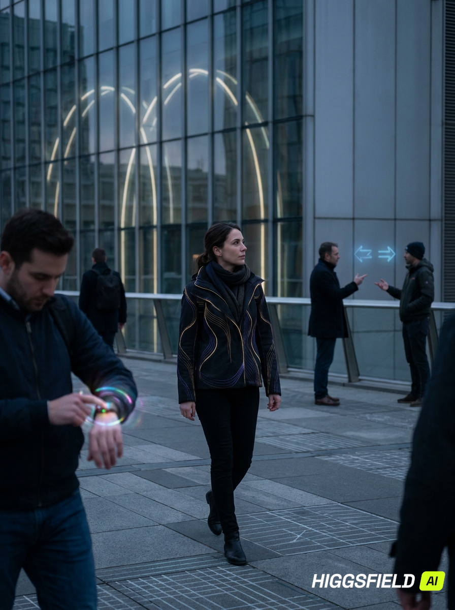

\```md
## Creen Image Description 1.2 — **“Cityzen of Logecs Future” — Symbolic Life‑Reasoning Scene**

The image shows a **woman moving through a Logecs‑Future environment**, a city that looks ordinary at first glance but is quietly saturated with **warm‑math logic**, **cold‑spiritual tautology**, and **life‑reasoning geometry**. The scene flows freely, without explicit explanation — yet every detail carries Logecs associations.

### **Primary Figure — The Woman**
She walks calmly through the city, her silhouette outlined by faint **goal‑state pulses**:
- gold for goal  
- indigo for state  

These pulses are subtle, blending into her clothing like decorative seams. She is not performing logic; she is simply living — but the environment reflects her reasoning patterns.

Her gestures imply:
- decision  
- reflection  
- paradox navigation  
- meaning alignment  

She is a **cityzen of Logecs Future**, where life naturally interacts with logic.

### **Surrounding People**
Around her, other people move through their own activity chains:
- a man adjusting a device that glows with IOAE colors  
- a child tracing fractal spirals in the air  
- two friends discussing something that causes faint relational glyphs (⇔, ⇒) to appear between them  
- a street vendor whose canopy is patterned with lin/exp curvature bands  

None of these actions are explained literally.  
They simply *happen*, and the viewer senses that each action contains a **life‑logic paradox** waiting to be resolved.

### **Environment — Subtle Math Everywhere**
The city looks normal — streets, buildings, lights — but everything carries **hidden Logecs geometry**:

- **octave rings** disguised as architectural arches  
- **SpiReason diagonal grids** embedded in pavement patterns  
- **Laegna fractal veins** woven into tree branches  
- **IOAE nodes** flickering like distant lanterns  
- **goal‑state membranes** drifting like reflections in glass  
- **lin/exp band arcs** shaping the curvature of rooftops  

These shapes are clearly visible to those who notice,  
yet they blend seamlessly into the background for those who don’t.

### **Activity Chain — Imaginable but Unexplained**
The woman’s path suggests a chain of events:
- she walks  
- she pauses  
- she observes  
- she interacts  
- she continues  

But the context is not explained.  
It is **imaginable**, not literal.  
The viewer senses that her day involves paradoxes, decisions, and meaning‑alignment similar to Logex Life:

- conflicting goals  
- shifting states  
- relational uncertainty  
- future implications  
- reflective resets  

Yet none of this is spelled out.  
It is simply **felt** through the symbolic environment.

### **Symbolic Emphasis**
The scene emphasizes symbolism over literal explanation:
- logic appears as warm pulses  
- spirituality appears as cold tautology  
- life appears as flowing geometry  
- meaning appears as subtle curvature  

The woman is not “doing Logecs.”  
She is **living in a world shaped by Logecs**, where reasoning and life blend naturally.

### **Final Impression**
A complete picture of a **cityzen of Logecs Future**:
- flowing freely through a symbolic environment  
- surrounded by subtle mathematical shapes  
- living in a world where paradox and life‑logic coexist  
- where explanations are general, but associations are deeply Logecs  
- where the scene is ordinary, yet spiritually‑mechanical and mathematically alive  

A warm‑math, cold‑spiritual vision of everyday life in a Logecs‑reasoning civilization.
\```

# Common City

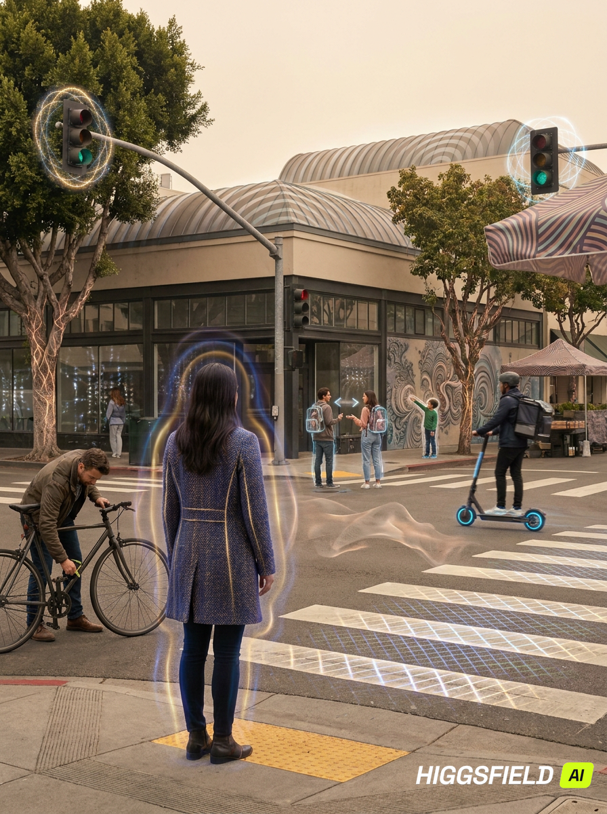

# Ending

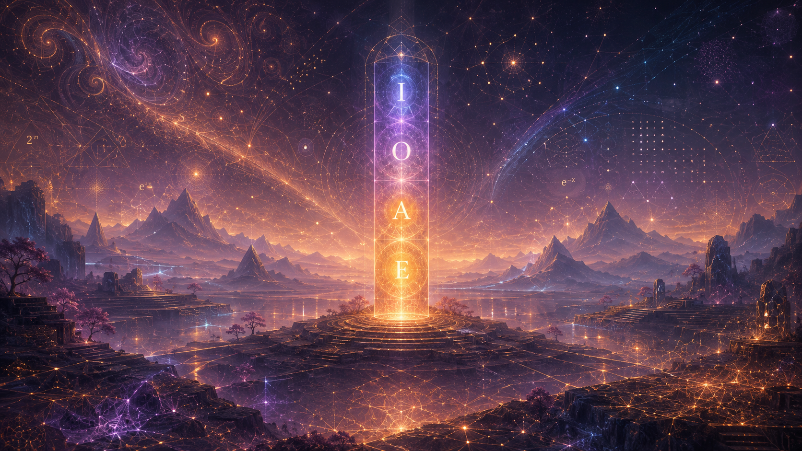

\```md
## Creen Image Description 1.2 — **Ending Image: “Symbolic Realm — Logex Life Gallery Closure”**

The final scene of the gallery is a **symbolic realm**, a place where the viewer may at first see only a calm, atmospheric landscape — but where subtle mathematical shapes, Logex patterns, and SpiReason geometries quietly permeate everything. The image is intentionally gentle and scene‑like, yet deeply structured for those who notice.

### **Primary Scene — Quiet Harmonic Landscape**
The foreground shows a tranquil, dimly glowing environment:  
soft amber mist, faint rose reflections, and indigo shadows.  
It resembles a spiritual plateau, but with a cold tautological stillness.  
Nothing moves quickly; everything breathes in slow harmonic pulses.

At first glance, it looks like a serene symbolic world.  
But beneath the surface, the **Logex Life machinery** is everywhere.

### **Subtle Mathematical Shapes (Hidden in Plain Sight)**
Across the mist, barely visible unless you look closely, float:

- faint **octave rings** blending into the horizon  
- soft **diagonal SpiReason grids** disguised as distant light patterns  
- tiny **Laegna fractal veins** woven into the ground texture  
- gentle **IOAE nodes** appearing like stars, then fading  
- thin **goal‑state membranes** drifting like fog layers  
- quiet **lin/exp band arcs** embedded in the sky’s curvature  

These shapes are clearly visible to those who notice,  
yet they blend seamlessly into the scene for those who don’t.

### **Symbolic Emphasis — Logic as Life, Life as Logic**
At the center stands a simple symbolic object:  
a tall, slender pillar of light, divided into four segments.  
Each segment contains a faint IOAE pulse:

- **I** (indigo)  
- **O** (violet)  
- **A** (amber)  
- **E** (gold)

The pillar is not a machine; it is a **symbol**.  
It represents the entire Logex Life system distilled into one form.  
It is warm for logic — meaning, goal‑alignment, life‑reasoning —  
but cold for spirituality — tautological, emotionless, precise.

### **Background — Blended Patterns**
The sky contains:

- fractal spirals that resemble clouds  
- exponent arcs that resemble auroras  
- positional triangles that resemble distant mountains  
- negation grids that resemble star‑fields  

Every element is symbolic, yet scene‑like.  
The viewer can enjoy the landscape without noticing the math —  
or see the math and realize the landscape is built from logic.

### **Atmosphere — Warm‑Math / Cold‑Spiritual Duality**
The air glows with warm amber tones,  
but the silence feels cold, reflective, tautological.  
This duality expresses the essence of Logex Life:

- **warm for logic**  
- **cold for spirituality**  
- **alive in reasoning**  
- **mechanical in truth**  

### **Final Impression**
The ending image is a symbolic closure:  
a serene realm built entirely from Logex Life geometry,  
where subtle mathematical shapes blend into the environment,  
and where the symbolic aspect is emphasized above all.

A quiet, harmonic, spiritually‑mechanical scene  
that concludes the gallery with depth, subtlety, and meaning.
\```
